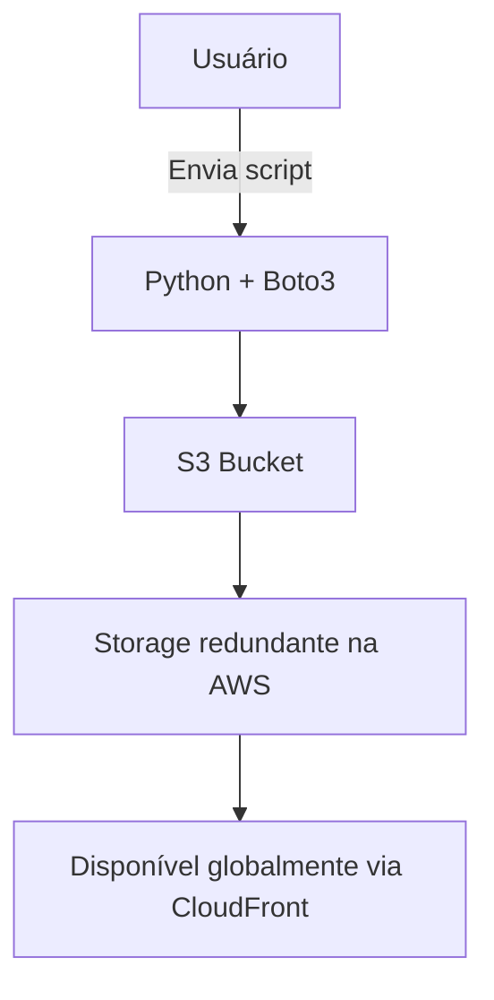
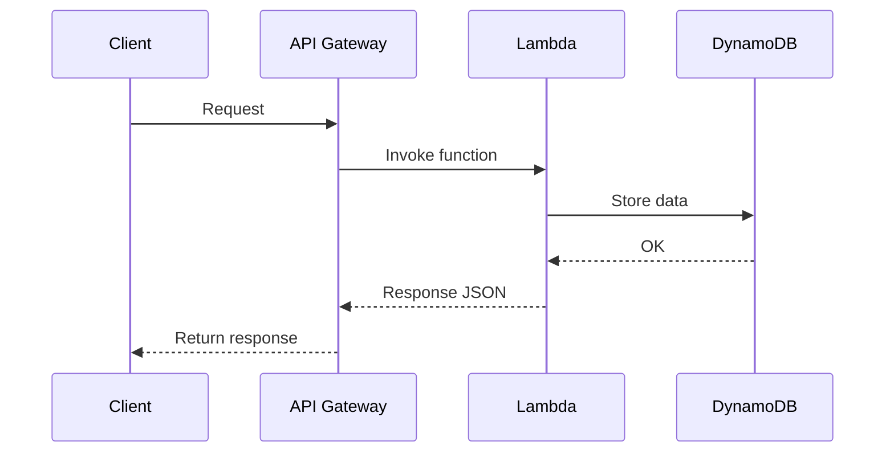
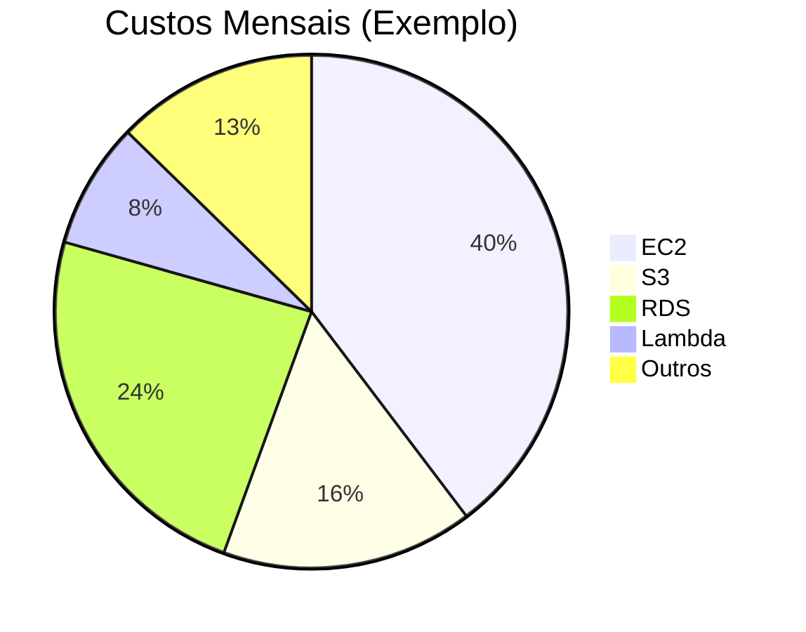

# 📘 Guia Completo AWS para Desenvolvedores Python
**Autor:** DevGege  
**Versão:** 1.0  
**Licença:** MIT  
**Formato:** Markdown – compatível com GitHub  
**Nível:** Intermediário → Avançado  

---

## 🧭 Sumário

1. [Introdução à AWS](#-introdução-à-aws)  
2. [Serviços Principais](#-serviços-principais)  
3. [Como Trabalhar com a AWS](#-como-trabalhar-com-a-aws)  
4. [CLI e Configuração](#-cli-e-configuração)  
5. [Uso com Python e Boto3](#-uso-com-python-e-boto3)  
6. [Conceitos Fundamentais](#-conceitos-fundamentais)  
7. [Mini Projeto: Backup Automático no S3](#-mini-projeto-backup-automático-no-s3)  
8. [Diagramas e Arquiteturas](#-diagramas-e-arquiteturas)  
9. [Otimização de Custos](#-otimização-de-custos)  
10. [Próximos Passos e Certificações](#-próximos-passos-e-certificações)  

---

## ☁️ Introdução à AWS

A **Amazon Web Services (AWS)** é a plataforma de **computação em nuvem mais usada do mundo**.  
Ela oferece **infraestrutura e serviços sob demanda**, como servidores, bancos de dados, armazenamento e inteligência artificial — tudo escalável e com cobrança sob uso.

---

## ⚙️ Serviços Principais

| Categoria | Serviço | Descrição |
|------------|----------|------------|
| 💻 **Computação** | **EC2** | Servidores virtuais Linux/Windows |
| 🗄️ **Banco de Dados** | **RDS**, **DynamoDB** | SQL e NoSQL gerenciados |
| 📦 **Armazenamento** | **S3** | Armazena arquivos, imagens, vídeos |
| 🌐 **Rede** | **VPC**, **CloudFront** | Configura rede, CDN e DNS |
| 🧩 **Serverless** | **Lambda** | Executa código sem servidor fixo |
| 🧠 **IA/ML** | **SageMaker**, **Rekognition** | Inteligência Artificial |
| 🔐 **Segurança** | **IAM**, **KMS** | Controle de permissões e chaves |

---

## 🧰 Como Trabalhar com a AWS

Você pode interagir com a AWS de **3 formas principais**:

### 1. **Console Web**
Interface gráfica via navegador → ideal para testes rápidos.

### 2. **CLI (Command Line Interface)**
Para automatizar com scripts.

```bash
aws s3 ls
aws ec2 describe-instances
aws lambda invoke --function-name minhaFuncao output.json
```

### 3. **SDK (Boto3 em Python)**
Permite integração programática:

```python
import boto3

s3 = boto3.client('s3')
s3.upload_file('arquivo.txt', 'meu-bucket', 'backup/arquivo.txt')
```

---

## 🧭 CLI e Configuração

Instale e configure a CLI:
```bash
pip install awscli
aws configure
```

Informe:
- **Access Key**
- **Secret Key**
- **Região padrão (ex: sa-east-1)**
- **Formato de saída (ex: json)**

---

## 🐍 Uso com Python e Boto3

### Instalação:
```bash
pip install boto3
```

### Exemplo: listar buckets existentes
```python
import boto3

s3 = boto3.client('s3')
for bucket in s3.list_buckets()['Buckets']:
    print(bucket['Name'])
```

### Exemplo: fazer upload
```python
import boto3

s3 = boto3.client('s3')
s3.upload_file('video.mp4', 'meu-bucket', 'videos/video.mp4')
```

---

## 🧩 Conceitos Fundamentais

| Conceito | Descrição |
|-----------|------------|
| **Região** | Local físico dos servidores (ex: `us-east-1`, `sa-east-1`) |
| **Zona de disponibilidade (AZ)** | Data centers dentro de uma região |
| **IAM** | Gerencia usuários e permissões |
| **Elasticidade** | Escala automática |
| **Alta disponibilidade** | Redundância entre regiões |

---

## 🚀 Mini Projeto: Backup Automático no S3

**Objetivo:** Criar um script que envia backups automáticos de uma pasta local para o S3.

```python
import boto3, os, datetime

BUCKET = 'meu-bucket-backup'
PASTA = '/home/devgege/backups'

s3 = boto3.client('s3')

for arquivo in os.listdir(PASTA):
    caminho = os.path.join(PASTA, arquivo)
    if os.path.isfile(caminho):
        data = datetime.datetime.now().strftime("%Y-%m-%d_%H-%M")
        s3.upload_file(caminho, BUCKET, f"{data}/{arquivo}")
        print(f"Backup enviado: {arquivo}")
```

---

## 🧱 Diagramas e Arquiteturas

### Diagrama de Arquitetura – Upload Automático S3


### Fluxo Serverless Lambda + API Gateway


---

## 💰 Otimização de Custos

| Serviço | Dica de Economia |
|----------|------------------|
| **EC2** | Use instâncias “spot” ou “t3.micro” no free tier |
| **S3** | Ative *lifecycle rules* para mover arquivos antigos ao Glacier |
| **Lambda** | Reduza memória alocada se a função for leve |
| **RDS** | Use *auto-stop* em ambientes de teste |
| **CloudWatch** | Limite métricas personalizadas |

### Diagrama de Custos Simulados


---

## 🧭 Próximos Passos e Certificações

- 🧾 **AWS Certified Cloud Practitioner** – Base conceitual  
- 🧩 **AWS Certified Developer – Associate** – Foco em integração via SDKs  
- ⚙️ **AWS Certified Solutions Architect – Associate** – Arquitetura e boas práticas  

**Sugestão:** use o [AWS Skill Builder](https://skillbuilder.aws) (gratuito) para treinar.

---

## 🏁 Conclusão

AWS é muito mais que um servidor em nuvem.  
É um **ecossistema de infraestrutura global**, pronto para **automação, escalabilidade e inovação** — perfeito para um engenheiro de software moderno como você.

---

**Assinado:**  
👨‍💻 *DevGege – Engenheiro de Software*  
📦 *“Automatizar é multiplicar tempo.”*
